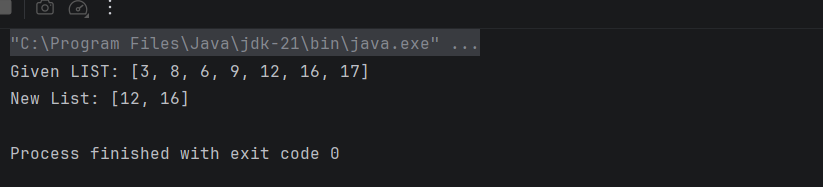
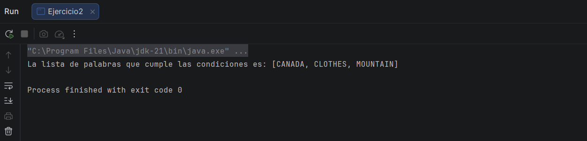
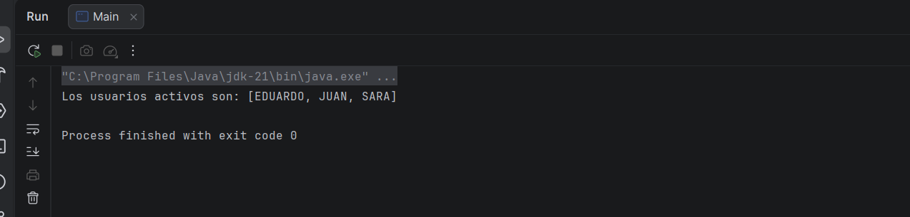
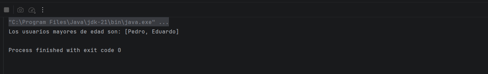
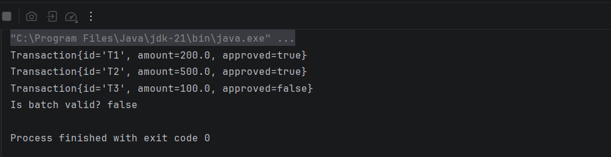

---

### 🧠 Autoevaluación

*¿Qué entendía mal antes?*  
> No entendía muy bien el funcionamiento de algunas de las funciones de stream y no tenia clara la sintaxis ni el uso en objetos

*¿Qué entiendo ahora?*  
> Ahora entiendo mejor la sintaxis y el uso de las funciones 

*¿Qué me falta reforzar?*  
> Considero que aun tengo defectos a la hora de pensar y organizar los problemas

---

---

## 🗓 Semana 1 – (Tema correspondiente)

### 📌 Temas trabajados
- Streams y objetos

### 💻 Evidencia Técnica

- Ejercicio #1
    

- Ejercicio #2
    

- Ejercicio #3
    

- Ejercicio #4
    

- Ejercicio #5
    
